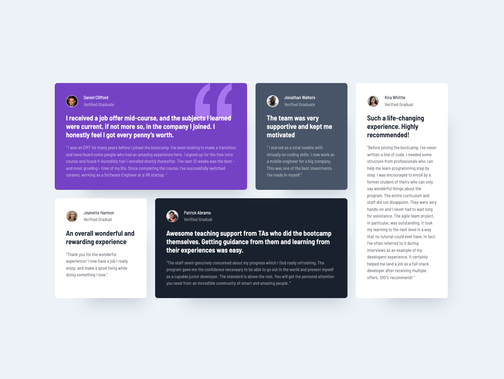

# Frontend Mentor - Testimonials grid section solution

This is a solution to the [Testimonials grid section challenge on Frontend Mentor](https://www.frontendmentor.io/challenges/testimonials-grid-section-Nnw6J7Un7).

## Table of contents

- [Overview](#overview)
  - [The challenge](#the-challenge)
  - [Screenshot](#screenshot)
- [My process](#my-process)
  - [Built with](#built-with)
  - [What I learned](#what-i-learned)
- [Author](#author)

## Overview

### The challenge

- View the optimal layout for the site depending on their device's screen size

### Screenshot Desktop ver.

### Screenshot Mobile ver.

### Links

- Live Site URL: [Solution link](https://mantasgarlauskas.github.io/testimonials-grid-section/)

## My process

### Built with

- Semantic HTML5 markup
- CSS custom properties
- CSS Grid
- Mobile-first workflow

### What I learned

Repeated HTML markup, CSS grid and mobile responsive.

## Author

- Website - [Github](https://github.com/MantasGarlauskas)
- Linkedin - [@MantasGarlauskas](https://www.linkedin.com/in/mantasgarlauskas/)
